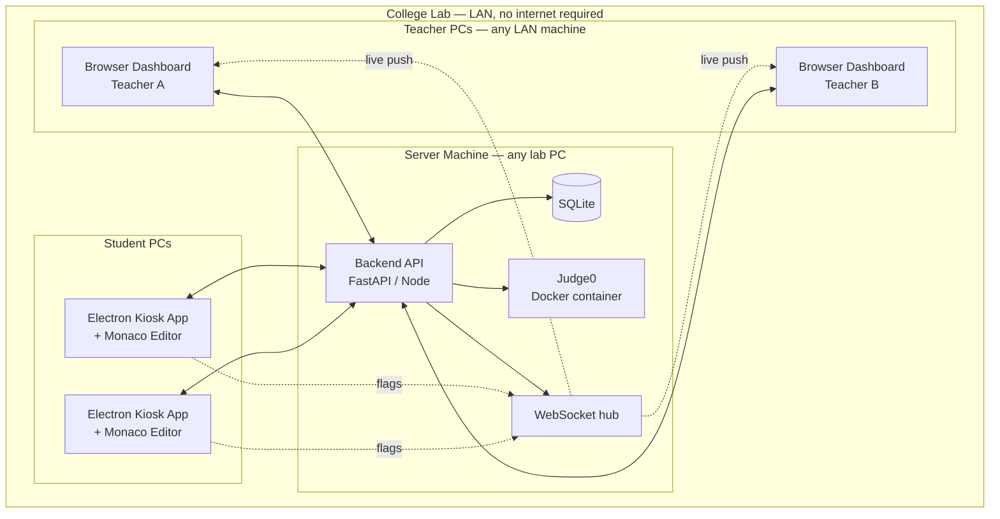
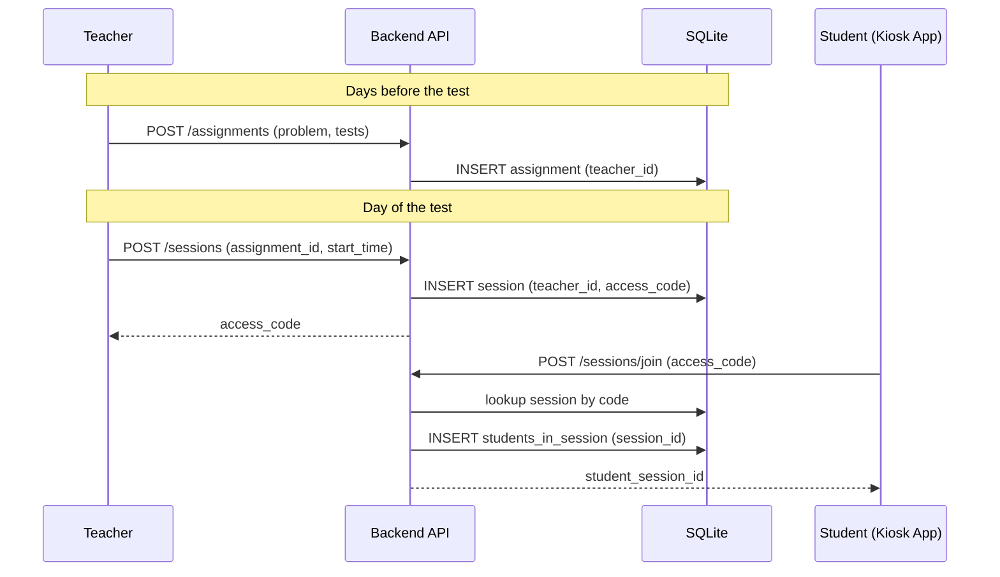
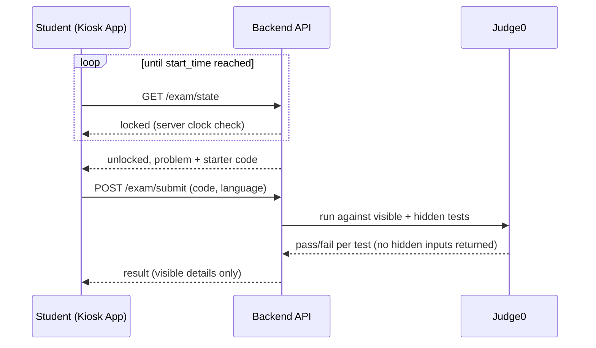
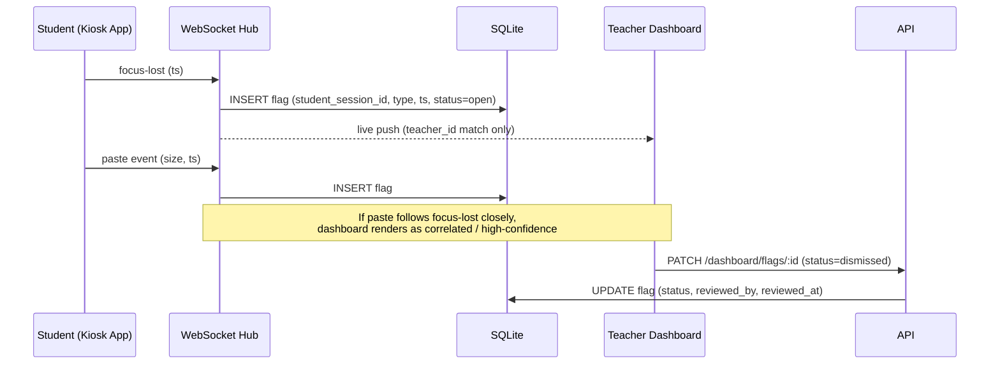
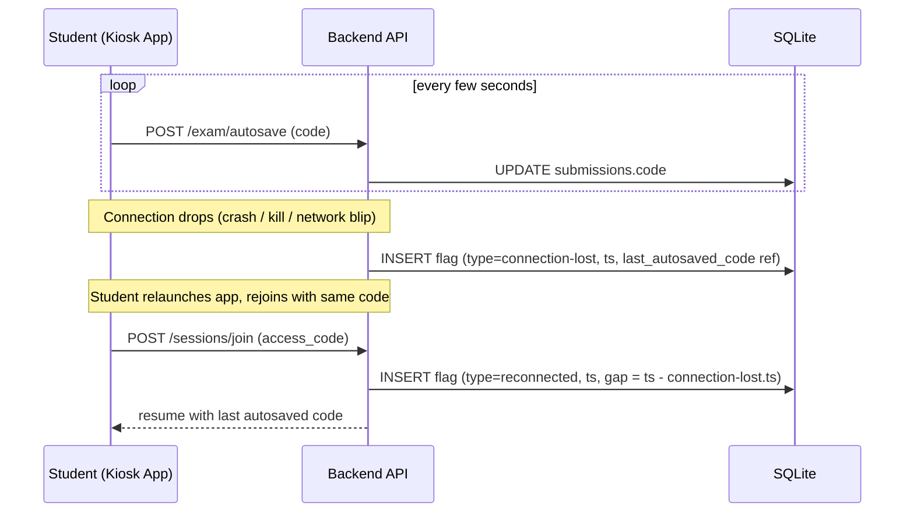

# System Design Document
## Secure Lab Assessment Platform

---

## 1. High-level architecture

## 2. Component responsibilities

| Component | Responsibility |
|---|---|
| Electron Kiosk App | Fullscreen lockdown, DevTools/right-click disabled, Monaco editor, emits focus/blur/paste/fullscreen-exit events, debounced autosave |
| Backend API | Auth, assignment/session CRUD, access-code validation, start-time gate, routes submissions to Judge0/SQL pipeline, scopes all teacher queries by `teacher_id` |
| Judge0 (Docker) | Sandboxed execution for C++/Python/Java against visible + hidden test cases, resource/time limits |
| SQL Grading Pipeline | Separate service: loads schema+seed, runs student query, normalizes and compares result sets order-agnostically |
| WebSocket Hub | Routes flag events from a student session to only the teacher who owns that session |
| SQLite DB | Source of truth: teachers, assignments, sessions, students_in_session, submissions, flags |
| Browser Dashboard | Teacher-only, non-kiosk, login-gated, live flag feed + assignment/session management |

## 3. Key sequence flows

### 3.1 Assignment authoring → session creation → student join

### 3.2 Locked exam start + submission grading

### 3.3 Live flag pipeline

### 3.4 Disconnect → autosave → reconnect

## 4. Design decisions and rationale

| Decision | Rationale |
|---|---|
| LAN client-server, not fully offline single-device | A single-device app would ship hidden test cases to the student's own disk — decryptable locally, since grading must happen locally. LAN keeps hidden tests server-side, genuinely hidden. |
| Electron kiosk, not browser tab | Browser tabs can't reliably disable DevTools (any page-level JS block is itself disableable from DevTools) and can't block browser extensions (an AI-copilot extension can render inline with zero focus change, defeating tab-switch detection entirely). |
| Detection + audit trail, not prevention/auto-penalty | True prevention requires kernel-level drivers — undeployable in a real college, unbuildable in hackathon time. A human-reviewed flag feed is honest about this limit and is what a real institution would actually adopt. |
| Flags marked "dismissed," never deleted | Preserves an audit trail for disputes; costs nothing extra to implement (a status enum vs. a delete call). |
| Continuous per-student flag timeline (not reset on reconnect) | The sequence of events around a disconnect (preceded by a tab-switch? followed by a large paste on return?) is what lets a teacher infer cause — the system doesn't need to diagnose intent, just preserve the evidence. |
| Teacher-scoping derived from JWT, never from a client-supplied session ID | Prevents one teacher from viewing another's data by editing a request parameter — the isolation must be structural (server-side), not policy-based. |

## 5. Open items / explicit limitations
- `window-all-closed` guard logic not yet defined — decide whether reconnect is always allowed (recommended) or requires teacher unlock.
- Parameterized hidden test values per session — only needed if a single assignment is ever reused across multiple same-day shifts of the same batch (currently not the case; deprioritized to Tier 3).
- Native Win32 foreground-window polling (Ctrl+Alt+Del → Task Manager case) — not covered by Electron's own `blur` event; Tier 3 stretch.
