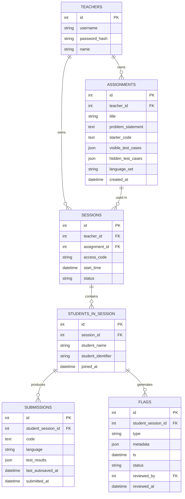

# Database Schema Document
## Secure Lab Assessment Platform

Database: **SQLite** (file-based, zero-config, sufficient for session-scoped MVP load on a single lab-LAN server)

---

## 1. Entity-relationship overview



## 2. Table definitions

### `teachers`
| Column | Type | Notes |
|---|---|---|
| `id` | INTEGER PK | |
| `username` | TEXT, unique | |
| `password_hash` | TEXT | bcrypt |
| `name` | TEXT | display name |

### `assignments`
| Column | Type | Notes |
|---|---|---|
| `id` | INTEGER PK | |
| `teacher_id` | INTEGER FK → teachers.id | **ownership — must be set at creation** |
| `title` | TEXT | |
| `problem_statement` | TEXT | |
| `starter_code` | TEXT | per-language, or JSON map |
| `visible_test_cases` | JSON | shown to student, used for "run" before submit |
| `hidden_test_cases` | JSON | **server-side only, never sent to client** |
| `language_set` | TEXT | e.g. `"cpp,python,java"` or `"sql"` |
| `created_at` | DATETIME | authored days ahead, reusable across sessions |

### `sessions`
| Column | Type | Notes |
|---|---|---|
| `id` | INTEGER PK | |
| `teacher_id` | INTEGER FK → teachers.id | redundant with assignment's owner but kept explicit for direct scoping queries |
| `assignment_id` | INTEGER FK → assignments.id | |
| `access_code` | TEXT(6), unique among **currently active** sessions | collision-checked only against active sessions at generation time |
| `start_time` | DATETIME | server-enforced lock until this timestamp |
| `status` | TEXT | `scheduled` / `active` / `closed` |

### `students_in_session`
| Column | Type | Notes |
|---|---|---|
| `id` | INTEGER PK | this is the `student_session_id` referenced everywhere downstream |
| `session_id` | INTEGER FK → sessions.id | determined by which access code the student typed |
| `student_name` | TEXT | |
| `student_identifier` | TEXT | roll number / enrollment ID |
| `joined_at` | DATETIME | |

### `submissions`
| Column | Type | Notes |
|---|---|---|
| `id` | INTEGER PK | |
| `student_session_id` | INTEGER FK → students_in_session.id | |
| `code` | TEXT | overwritten on every autosave; final value at submit time is the graded version |
| `language` | TEXT | |
| `test_results` | JSON | pass/fail per test, **hidden test inputs/outputs never stored here in plaintext retrievable by client-facing endpoints** |
| `last_autosaved_at` | DATETIME | debounced, every few seconds |
| `submitted_at` | DATETIME | null until final submit |

### `flags`
| Column | Type | Notes |
|---|---|---|
| `id` | INTEGER PK | |
| `student_session_id` | INTEGER FK → students_in_session.id | |
| `type` | TEXT | `focus-lost` / `focus-regained` / `fullscreen-exit` / `paste` / `connection-lost` / `reconnected` |
| `metadata` | JSON | e.g. paste size, gap duration, correlated-flag reference |
| `ts` | DATETIME | |
| `status` | TEXT | `open` / `dismissed` / `escalated` — **never hard-deleted** |
| `reviewed_by` | INTEGER FK → teachers.id | nullable until reviewed |
| `reviewed_at` | DATETIME | nullable |

## 3. Critical query pattern — teacher data isolation

**Every dashboard-facing query must derive scope from the authenticated teacher's ID (from their JWT/session), never from a session ID supplied by the client request.** This is what makes multi-teacher isolation structural rather than a permission check that can be bypassed by editing a request parameter.

```sql
-- Correct: teacher_id comes from server-side auth context, not the request body/query
SELECT f.*
FROM flags f
JOIN students_in_session s ON f.student_session_id = s.id
JOIN sessions sess ON s.session_id = sess.id
WHERE sess.teacher_id = :authenticated_teacher_id;
```

```sql
-- Wrong: never do this — session_id from the client lets Teacher B request Teacher A's data
SELECT * FROM flags WHERE student_session_id IN
  (SELECT id FROM students_in_session WHERE session_id = :client_supplied_session_id);
```

## 4. Indexing notes (for a working demo, not premature optimization)
- Index `sessions.access_code` (lookup on every student join).
- Index `flags.student_session_id` and `flags.ts` (dashboard live feed queries by recency).
- Index `assignments.teacher_id` and `sessions.teacher_id` (every teacher-scoped list view).

## 5. Explicitly out of scope for MVP schema
- No cross-session history/gradebook tables — a session's data is not aggregated across a teacher's past exams in this version.
- No parameterized/randomized hidden test case variants per session — schema stores one fixed `hidden_test_cases` blob per assignment (add a `session_test_overrides` table later if same-batch same-day shifts on one assignment become a real usage pattern).
