# Tide V1: Detailed 10-Hour Implementation Plan & Technical Blueprint

**Target:** Working MVP for Mid-Evaluation (T + 10 Hours)  
**System:** LAN-based Client-Server Coding Assessment Platform  
**Target Date/Time:** Morning Evaluation (~11:45 AM)  

---

## ⏱️ Master 10-Hour Timeline

```mermaid
gantt
    title Tide V1 10-Hour Sprint Roadmap
    dateFormat X
    axisFormat %s hr
    
    section Backend Core
    Auth & DB Setup           :b1, 0, 2
    Assignment & Session APIs :b2, 1, 2
    
    section Execution Engine
    Local Sandbox Runner      :e1, 2, 4
    SQL Grading Pipeline      :e2, 3, 4
    
    section Student Kiosk
    Electron Lockdown & IPC   :k1, 4, 5
    Monaco UI & Autosave      :k2, 4, 6
    
    section Live Telemetry & Dashboard
    WebSocket Hub & Events    :w1, 6, 7
    Teacher Dashboard UI      :w2, 6, 8
    
    section Testing & Rehearsal
    End-to-End LAN Testing    :t1, 8, 9
    Demo Rehearsal & Polish   :t2, 9, 10
```



---

## 🏗️ Architectural Component Breakdown

```
Tide/
├── server/                               # FastAPI + SQLite Backend
│   ├── app/
│   │   ├── api/
│   │   │   ├── auth.py                   # Teacher Register/Login & JWT
│   │   │   ├── assignments.py            # Assignment authoring & visible/hidden tests
│   │   │   ├── sessions.py               # Day-of 6-char code session scheduling
│   │   │   ├── exam.py                   # State gate, run, submit, autosave
│   │   │   ├── telemetry.py              # WebSocket hub for flags
│   │   │   └── dashboard.py              # Teacher-scoped live monitoring queries
│   │   ├── core/
│   │   │   ├── config.py                 # App settings & JWT secret
│   │   │   ├── database.py               # SQLite connection & sessionmaker
│   │   │   └── security.py               # Passlib bcrypt & JWT encoders/decoders
│   │   ├── models/
│   │   │   └── entities.py               # Relational SQLite models
│   │   ├── schemas/                      # Pydantic request/response models
│   │   └── services/
│   │       ├── sandbox.py                # Sandboxed local runner (Python, C++, Java)
│   │       ├── sql_grader.py             # In-memory SQLite result set comparator
│   │       └── judge0_client.py          # Docker Judge0 API integration
├── client-student/                       # Electron Kiosk App
│   ├── src/
│   │   ├── main.js                       # Electron security, window config, shortcut blocks
│   │   ├── preload.js                    # Context bridge for telemetry & IPC
│   │   ├── renderer.js                   # Monaco editor setup & state coordinator
│   │   ├── index.html                    # Exam UI & layout
│   │   └── styles.css                    # Dark theme exam environment
└── client-teacher/                       # Teacher Web Dashboard (SPA / Clean HTML+JS)
    ├── index.html                        # Dashboard views (Login, Assignments, Sessions, Live Flags)
    ├── app.js                            # WebSocket live listener & API caller
    └── styles.css                        # Modern proctoring monitoring UI
```

---

## 🛠️ Step-by-Step Technical Implementation Spec

---

### Step 1: Backend Security, Auth & Data Tier (Hours 0.0 – 2.0)

#### 1.1 Authentication & Security (`server/app/core/security.py`)
- Password hashing with `passlib.context.CryptContext(schemes=["bcrypt"])`.
- JWT token generator: `create_access_token(data={"sub": str(teacher.id), "username": teacher.username})`.
- FastAPI Dependency: `get_current_teacher(token)` decodes token, validates claims, fetches teacher record, and injects `current_teacher` into request context.

#### 1.2 Authentication Endpoints (`server/app/api/auth.py`)
* `POST /api/auth/register`:
  - Body: `{ username, password, name }`
  - Validates uniqueness, hashes password, saves to DB.
* `POST /api/auth/login`:
  - Body: `{ username, password }`
  - Validates credentials, returns `{ access_token, token_type: "bearer", teacher: { id, name, username } }`.
* `GET /api/auth/me`:
  - Returns authenticated teacher profile.

#### 1.3 Assignment Authoring API (`server/app/api/assignments.py`)
* `POST /api/assignments`:
  - Body: `{ title, problem_statement, starter_code, visible_test_cases, hidden_test_cases, language_set }`
  - **Ownership:** Automatically sets `teacher_id = current_teacher.id`.
* `GET /api/assignments`:
  - Query strictly filtered: `SELECT * FROM assignments WHERE teacher_id = current_teacher.id`.
* `GET /api/assignments/{id}`:
  - Verifies assignment belongs to `current_teacher.id`.

#### 1.4 Session Scheduling API (`server/app/api/sessions.py`)
* `POST /api/sessions`:
  - Body: `{ assignment_id, start_time }`
  - Generates 6-character uppercase alphanumeric code (e.g. `TID942`).
  - Collision check against currently `active` or `scheduled` sessions.
  - Automatically associates `teacher_id = current_teacher.id`.
* `GET /api/sessions`:
  - Lists sessions owned by the authenticated teacher with active student count.
* `GET /api/sessions/{id}`:
  - Returns session details, linked assignment metadata, and roster of connected students.

---

### Step 2: Polyglot Execution & SQL Grading Engine (Hours 2.0 – 4.0)

To guarantee 100% demo reliability even if Docker is absent on the testing PC, we build a **Dual-Engine Sandbox Architecture**:
1. **Engine A (Docker Judge0 Client):** Connects to `http://localhost:2358` if available.
2. **Engine B (Isolated Local Subprocess Sandbox):** Standard built-in runner with resource/time limits, process group kills, and stdout/stderr capture.

#### 2.1 Local Execution Engine (`server/app/services/sandbox.py`)
- **Python Execution:**
  - Writes submission to temp file `solution.py`.
  - Runs with `subprocess.Popen([sys.executable, "solution.py"], stdin=PIPE, stdout=PIPE, stderr=PIPE)`.
  - Enforces execution timeout (`timeout=3.0` seconds).
  - Captures stdout/stderr, compares with expected output (trimmed whitespace).
- **C++ Execution:**
  - Compiles with `g++ -O2 solution.cpp -o solution.exe` (if g++ available).
  - Runs executable with time and memory boundaries.
- **Java Execution:**
  - Compiles with `javac Solution.java`, runs `java Solution`.
- **Output Diffing:**
  - Trims trailing whitespace and carriage returns (`\r\n` $\rightarrow$ `\n`).
  - Returns `{ test_id, passed: bool, actual_output, expected_output (only if visible), execution_time_ms, error }`.

#### 2.2 Dedicated SQL Grading Engine (`server/app/services/sql_grader.py`)
* **Problem:** Direct stdout comparisons fail on SQL queries due to random row ordering, whitespace, and column naming differences.
* **Pipeline Implementation:**
  1. Initialize fresh in-memory SQLite connection (`sqlite3.connect(":memory:")`).
  2. Execute question's DDL & DML (`schema_seed_sql`).
  3. Execute student query `student_query`.
  4. Fetch result rows and column descriptions.
  5. Execute instructor's reference query on an identical fresh database instance.
  6. **Normalize & Compare:**
     * If query contains `ORDER BY`: Exact sequence row comparison.
     * If query has no `ORDER BY`: Multiset / sorted row comparison (order-agnostic).
     * Float precision roundoff to 4 decimal places.
     * Case-insensitive column name verification if required.
  7. Return pass/fail status without leaking reference query or expected table rows for hidden test cases.

---

### Step 3: Exam State, Start-Gate & Autosave API (Hours 4.0 – 5.0)

#### 3.1 Student Session Gateway (`server/app/api/exam.py`)
* `POST /api/sessions/join`:
  - Body: `{ access_code, student_name, student_identifier }`
  - Validates 6-char code against active sessions.
  - Creates or retrieves `StudentInSession` record.
  - Initializes blank `Submission` row if first join.
  - Returns `{ student_session_id, session_id, student_name, student_identifier }`.

* `GET /api/exam/state/{student_session_id}`:
  - Fetches session details via `student_session.session`.
  - Compares `datetime.now(timezone.utc)` with `session.start_time`.
  - **If `now < start_time` (Locked):**
    - Returns `{ status: "locked", start_time, server_time, remaining_seconds }`.
    - **Crucial:** Does NOT return problem statement, starter code, or test cases.
  - **If `now >= start_time` (Unlocked):**
    - Returns `{ status: "active", title, problem_statement, starter_code, visible_test_cases, language_set }`.
    - **Confidentiality Rule:** `hidden_test_cases` are completely excluded from the JSON payload.

* `POST /api/exam/run`:
  - Body: `{ student_session_id, code, language }`
  - Executes code **only** against `visible_test_cases`.
  - Returns full outputs, stdout, stderr, and pass/fail for visible tests so the student can debug.

* `POST /api/exam/submit`:
  - Body: `{ student_session_id, code, language }`
  - Fetches both visible AND server-side hidden test cases from `assignments` table.
  - Executes full test suite.
  - Stores submission in DB: `test_results = summary`, `submitted_at = utc_now()`.
  - Returns student-safe payload:
    - `{ total_tests, passed_tests, visible_results: [...], hidden_summary: { total: 3, passed: 3 } }`.
    - **Hidden test inputs/outputs are never returned.**

* `POST /api/exam/autosave`:
  - Body: `{ student_session_id, code, language }`
  - Updates `submissions.code`, `submissions.language`, and `submissions.last_autosaved_at = utc_now()`.
  - Returns `{ status: "saved", timestamp }`.

---

### Step 4: Student Kiosk Client & Monaco Integration (Hours 5.0 – 6.5)

#### 4.1 Electron Hardening (`client-student/src/main.js`)
- Fullscreen kiosk configuration:
  ```javascript
  mainWindow = new BrowserWindow({
    fullscreen: true,
    kiosk: true,
    frame: false,
    autoHideMenuBar: true,
    alwaysOnTop: true,
    webPreferences: {
      devTools: false,
      nodeIntegration: false,
      contextIsolation: true,
      preload: path.join(__dirname, 'preload.js')
    }
  });
  ```
- **Keyboard Shortcut Interception:**
  Block `F12`, `Ctrl+Shift+I`, `Ctrl+Shift+J`, `Ctrl+Shift+C`, `F5`, `Ctrl+R`.
- **Context Menu:** Block right-click entirely.
- **Window Blur / Focus Events:**
  - `mainWindow.on('blur')` $\rightarrow$ notify renderer to send `focus-lost`.
  - `mainWindow.on('focus')` $\rightarrow$ notify renderer to send `focus-regained`.
- **Fullscreen Guard:**
  - `mainWindow.on('leave-full-screen')` $\rightarrow$ emit `fullscreen-exit` telemetry, call `mainWindow.setFullScreen(true)` immediately.

#### 4.2 Monaco Editor & Student Interface (`client-student/src/renderer.js` & `index.html`)
- **Stage 1 (Join View):** 
  - Inputs for Access Code, Student Name, Roll Number, Server IP (`http://localhost:8000` or LAN IP).
- **Stage 2 (Countdown View):** 
  - Big countdown timer: "Exam begins in 00:04:12".
  - Polls server clock every second until unlock.
- **Stage 3 (Exam View):**
  - Left panel: Problem statement (Markdown rendered) + Visible test cases table.
  - Right panel: Embedded Monaco Editor (Python / C++ / Java / SQL syntax mode).
  - Bottom panel: Console output, run results, test case tabs.
  - Header: Time remaining, "Autosaved" status indicator, Submit button with confirmation dialog.
- **Autosave Pipeline:**
  - Debounced listener on Monaco editor changes (`lodash.debounce` or 3-second setTimeout).
  - Sends `POST /api/exam/autosave` and blinks a green "● Autosaved" indicator.
- **Paste Interceptor:**
  - Monaco `onDidPaste` event listener.
  - Calculates length of pasted string.
  - Sends telemetry flag via WebSocket (`type: "paste"`, `metadata: { length: pastedText.length }`).

---

### Step 5: Real-Time Telemetry & Teacher Dashboard (Hours 6.5 – 8.0)

#### 5.1 WebSocket Telemetry Hub (`server/app/api/telemetry.py`)
- Maintains active WebSocket connections:
  - Student sockets: `/ws/student/{student_session_id}`
  - Teacher sockets: `/ws/teacher?token={jwt_token}`
- **Flag Flow:**
  1. Student client sends event: `{ type: "focus-lost", ts: "..." }`.
  2. Server saves event to SQLite `flags` table with `status = "open"`.
  3. Server identifies which teacher owns this student's session.
  4. Server broadcasts the flag JSON to the connected teacher's WebSocket feed.

#### 5.2 Teacher Browser Dashboard (`client-teacher/index.html` & `app.js`)
- Single Page Web Application served directly or reachable via LAN browser (`http://SERVER_IP:8000/dashboard`).
- **Views:**
  1. **Login View:** Clean instructor authentication.
  2. **Assignment Studio:** Create problems, set starter code, configure visible/hidden test cases.
  3. **Session Launcher:** Select assignment, pick start time, view generated 6-character code (large display mode for lab projector).
  4. **Live Exam Monitor (The Key Demo Screen):**
     - **Active Student Roster:** Table showing Roll Number, Name, Current Code Size, Last Autosaved Time, Connection Status.
     - **Live Flag Feed:** Real-time stream of incoming security events:
       - 🟡 `focus-lost` (Student navigated away or alt-tabbed)
       - 🟢 `focus-regained` (Student returned)
       - 🔴 `fullscreen-exit` (Attempted to minimize/exit kiosk)
       - 🟠 `paste (N characters)` (Pasted text into editor)
     - Flag action button: "Mark Reviewed" (prepares for V2 audit workflow).

---

### Step 6: Integration, Testing & Fallbacks (Hours 8.0 – 9.0)

1. **Local Test Script (`server/tests/test_v1_flow.py`):**
   - Script simulating full lifecycle:
     - Register teacher $\rightarrow$ Login $\rightarrow$ Create assignment $\rightarrow$ Create session.
     - Student joins $\rightarrow$ Verifies lock before start $\rightarrow$ Unlocks after start.
     - Autosaves code $\rightarrow$ Runs visible tests $\rightarrow$ Submits for hidden tests $\rightarrow$ Verifies grade.
     - Sends telemetry flags $\rightarrow$ Verifies flag recorded in DB.
2. **Zero-Internet & LAN Network Test:**
   - Disconnect Wi-Fi internet or disable gateway.
   - Run backend on LAN IP (`0.0.0.0:8000`).
   - Connect student client using machine IP (e.g. `192.168.1.15:8000`).
   - Confirm complete operation without any external requests.
3. **Execution Fallback Guarantee:**
   - Verify Python and SQLite runners work out of the box on Windows without Docker.

---

### Step 7: Presentation & Live Demo Rehearsal (Hours 9.0 – 10.0)

1. **Pre-Seed Database:**
   - Teacher account: `prof_sharma` / `admin123`.
   - Sample Question 1: *"Two Sum Problem"* (Python - 2 visible tests, 3 hidden edge cases).
   - Sample Question 2: *"Department Salary Query"* (SQL - SQLite seed with employee/dept tables).
2. **Rehearse the 3-Minute Live Demo:**
   - **Minute 0–1:** Teacher creates session, code `TIDE01` shown on projector. Student kiosk enters code, shows locked countdown.
   - **Minute 1–2:** Clock hits start time $\rightarrow$ Kiosk unlocks $\rightarrow$ Student types code. Student presses `Alt+Tab` $\rightarrow$ Teacher dashboard immediately flashes yellow `focus-lost`.
   - **Minute 2–3:** Student copies code and pastes into editor $\rightarrow$ Teacher dashboard flashes `paste (95 chars)`. Student runs visible tests (passes) and submits (passes 5/5 hidden tests, hidden inputs protected).

---

## 🛡️ V1 Risk Mitigation & Contingency Matrix

| Risk | Probability | Impact | Immediate Mitigation in V1 |
|---|---|---|---|
| Docker unavailable on lab PC | High | High | Dual-Engine sandbox: Local Python `subprocess` runner and in-memory SQLite runner built as default, Docker Judge0 as plug-in. |
| Student kiosk crashes or freezes | Low | Medium | Autosave every 3 seconds ensures code is saved in SQLite; student can relaunch and resume. |
| LAN IP changes / unknown | Medium | Low | Server prints LAN IP clearly on startup (`Uvicorn running on http://192.168.x.y:8000`). Student app allows server IP input on welcome screen. |
| Monaco Editor offline loading issue | Low | Medium | Package Monaco editor scripts locally inside `client-student` so no CDN requests are made. |

---

## 📋 File Checklist to Build for V1

- [ ] `server/app/core/security.py` (bcrypt + JWT)
- [ ] `server/app/schemas/all.py` (Pydantic models for Auth, Assignments, Sessions, Submissions, Flags)
- [ ] `server/app/api/auth.py` (Register, Login, Me)
- [ ] `server/app/api/assignments.py` (CRUD assignments)
- [ ] `server/app/api/sessions.py` (Create & List sessions)
- [ ] `server/app/api/exam.py` (Join, State check, Run, Submit, Autosave)
- [ ] `server/app/api/telemetry.py` (WebSocket hub)
- [ ] `server/app/services/sandbox.py` (Local Python/C++ code runner)
- [ ] `server/app/services/sql_grader.py` (In-memory SQLite schema+seed comparator)
- [ ] `server/app/main.py` (Wire all routers + static dashboard mount)
- [ ] `client-student/src/main.js` (Electron lockdown & window management)
- [ ] `client-student/src/preload.js` (IPC bridge)
- [ ] `client-student/src/renderer.js` & `index.html` (Monaco editor + Exam views)
- [ ] `client-teacher/index.html` & `app.js` (Web dashboard with live WebSocket flag monitor)
