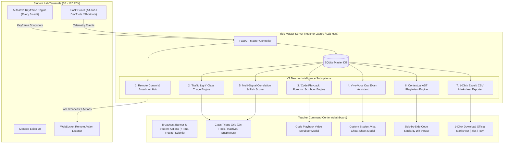

# Tide V2: Comprehensive Implementation Plan & Technical Blueprint

**Project:** Tide — Secure Lab Assessment Platform  
**Phase:** V2 (Advanced Classroom Control, Viva-Voce Intelligence, Forensic Replay & Automated Marksheet)  
**Timeline:** Checkpoint 2 (Final Evaluation & Production Hardening)  
**Architecture:** LAN-Based Client-Server (Zero External Internet Required)  

---

## 🎯 Executive Summary & The College Lab Problem

In a real college computer science lab exam with 60 to 120 students:
1. **Teachers are overwhelmed by lab chaos:** shouting announcements across noisy rooms, managing student PCs that crash or reboot, and babysitting endless streams of false-alarm notifications.
2. **Naive plagiarism detectors fail:** simple questions cause innocent students to write nearly identical syntax, creating hundreds of false positives.
3. **Teachers need conclusive proof for viva & grading:** when an accused student claims *"I wrote this myself!"*, the teacher needs indisputable keystroke playback and tailored oral examination questions to establish the truth in 30 seconds.
4. **Grading bureaucracy takes hours:** professors manually tally visible tests, hidden tests, penalty deductions, and format spreadsheets for university portals.

### The V2 Value Proposition
> *"Tide V2 transforms the teacher's workstation into an intelligent Command Center: giving professors live remote control over all kiosk screens, an interactive Code Playback video scrubber, auto-generated Viva-Voce oral questions, multi-signal plagiarism detection that eliminates false positives, and 1-click official Excel marksheet exports."*

---

## 🗺️ V2 System Architecture Diagram



---

## 📦 Detailed Breakdown of V2 Subsystems

---

### Subsystem 1: 🎙️ Live Remote Classroom Control & Announcement Channel

#### The Problem
In college labs, teachers constantly need to clarify questions (*"In Question 2, assume arrays can have negative numbers!"*), warn loud students, or grant extra time to a student whose machine rebooted. Shouting creates chaos.

#### Technical Specification
1. **Class-Wide Broadcast Announcements:**
   - Teacher types a message in the dashboard header: `[📢 Broadcast to All]`.
   - Backend broadcasts `{"event": "class_announcement", "message": text, "urgent": true}` to all connected kiosk WebSockets.
   - Every student kiosk displays an immediate high-contrast modal or top banner with an acknowledgment button.
2. **Per-Student Remote Intervention:**
   - **`+5 / +10 Mins` Extra Time:**
     - Extends the individual student's session clock in SQLite (`StudentInSession.extra_time_seconds += 300`).
     - Kiosk countdown updates in real time over WebSocket.
   - **Direct Proctor Warning:**
     - Teacher clicks `[⚠️ Send Warning]` on a specific student:
     - Kiosk displays a warning banner: *"Instructor Notice: Focus on your own monitor. Suspicious activity has been logged."*
   - **Remote Screen Freeze / Lockout:**
     - Temporarily disables the Monaco editor if a student is caught talking.
   - **Force Submit:**
     - Remotely terminates the exam and runs final hidden grading for students who refuse to submit when time expires.

---

### Subsystem 2: 🚦 "Traffic Light" Classroom Triage Grid (Zero Alert Fatigue)

#### The Problem
Teachers hate reading a continuous feed of 400 individual alert badges. They need an instant, high-level visual summary of room health.

#### Technical Specification
The dashboard provides a **3-Column Real-Time Triage Grid**:
1. 🟢 **Zone 1: On Track (Clean)**
   - Normal typing velocity, debounced autosaves active, visible tests executing normally, zero critical flags.
   - Teacher ignores these students.
2. 🟡 **Zone 2: Struggling / Idle (Academic Assistance)**
   - 0 lines of code written for $> 10$ minutes, or $> 6$ consecutive failing test runs with syntax errors.
   - Identifies students who are stuck and need instructor guidance.
3. 🔴 **Zone 3: High Suspicion (Proctor Attention)**
   - Window blur duration $> 45\text{s}$, external paste event $\ge 20$ chars, or sudden 0-to-40 line code drop.
   - One click opens their **Code Playback** or **Viva Assistant**.

---

### Subsystem 3: ⏪ "Code Playback" Forensic Replay Scrubber

#### The Problem
When a student is confronted with a cheating allegation, they almost always claim: *"No sir, I typed every single line myself!"* Without a keystroke timeline, the teacher cannot prove otherwise.

#### Technical Specification
1. **Autosave Keyframe Logging:**
   - Modify `/api/exam/autosave` to record incremental keyframe diffs in SQLite:
     ```python
     class CodeSnapshot(Base):
         __tablename__ = "code_snapshots"
         id = Column(Integer, primary_key=True)
         student_session_id = Column(Integer, ForeignKey("students_in_session.id"), index=True)
         code = Column(Text, nullable=False)
         lines_count = Column(Integer, nullable=False)
         is_paste = Column(Boolean, default=False)
         paste_length = Column(Integer, default=0)
         ts = Column(DateTime, default=utc_now, index=True)
     ```
2. **Interactive Video Scrubber UI:**
   - Teacher opens the student's profile and clicks **"⏪ Replay Code"**.
   - An interactive slider (00:00 to 45:00) with a `[▶ Play / ⏸ Pause]` button.
   - The editor view updates smoothly as the slider moves, showing the code growing line by line.
   - **Red Timeline Markers:** Flagged points where paste events occurred appear in red on the scrubber track.
   - **Forensic Proof:** The teacher drags the slider and shows the student:
     *"At 10:14:10 you had 0 lines. At 10:14:13 (3 seconds later), 38 lines appeared all at once. How did you type 38 lines in 3 seconds?"*

---

### Subsystem 4: 🎓 The Viva-Voce (Oral Exam) Assistant

#### The Problem
Even if a student uses an unauthorized mobile phone or memorized a leaked solution, **they cannot explain the code under direct oral examination**. But professors don't have time to invent custom questions on the spot for 60 students.

#### Technical Specification
Tide's **Viva Assistant Engine** (`server/app/services/viva_generator.py`) inspects the student's final code AST, test results, and behavioral anomalies to generate **3 Tailored Viva Questions**:
1. **Question 1: Suspicious Code Origin (Anomaly-Driven):**
   - If lines 12–24 were pasted:
     - *"Lines 12–24 appeared suddenly. Ask: 'Explain line 18: why did you choose bitwise XOR `a ^ b` here instead of an arithmetic operation?' "*
2. **Question 2: Algorithmic Logic & Complexity:**
   - Inspects loop structures and recursion:
     - *"Ask: 'What is the worst-case time complexity of your nested loop on line 9? How would your solution behave if $N = 10^7$?' "*
3. **Question 3: Edge Case Verification:**
   - Checks which tests passed/failed:
     - *"Ask: 'Your code passed odd-number inputs but failed when array length was 0. How would you handle an empty input array on line 4?' "*

The teacher clicks **"🎓 Viva Prep"** on any student row $\rightarrow$ a compact cheat-sheet card opens on their screen/tablet $\rightarrow$ the teacher calls the student for a 45-second viva.

---

### Subsystem 5: 🔍 Contextual AST Plagiarism & Multi-Signal Correlation

#### The Problem
Simple questions (prime numbers, factorial, two sum) naturally produce identical AST syntax across innocent students. Isolated AST checkers flag the whole class.

#### The Solution: The 4 Correlation Filters
1. **Starter Code & Canonical Skeleton Masking:**
   - The engine parses `assignment.starter_code` and the canonical trivial skeleton, removing standard boilerplate from the tree comparison.
2. **Sudden-Birth Check (Progression Correlation):**
   - High AST similarity is ONLY elevated to a high-confidence cheating flag if the student's code appeared abruptly (0 to 40 lines in $< 10$ seconds).
3. **Behavioral Telemetry Alignment:**
   - Compares the timestamp of the paste/appearance with peer submission times ($\Delta t_{\text{peer}} \le 90\text{s}$) or window-blur duration.
4. **Idiosyncratic Quirk Fingerprinting:**
   - Detects shared weird constants (e.g. `val = -99999`), shared unused variables (`temp_k = 0`), or identical non-standard variable initializations.
5. **Interactive Similarity Studio:**
   - Teacher dashboard includes a **Side-by-Side Diff Modal** with synchronized scrolling showing Student A vs Student B with identical syntax tokens highlighted in yellow.

---

### Subsystem 6: 📊 1-Click Official University Marksheet Export (Excel / CSV)

#### The Problem
After an assessment, instructors waste hours manually tallying marks, downloading raw outputs, and formatting sheets for university portals.

#### Technical Specification
1. **Export Endpoint (`/api/sessions/{session_id}/export/marksheet`):**
   - Generates production-ready `.xlsx` (using `openpyxl`) and standard `.csv`.
2. **Spreadsheet Columns:**
   - `Roll Number`
   - `Student Name`
   - `IP Address / Terminal ID`
   - `Joined Time`
   - `Submission Time`
   - `Visible Tests Passed` (e.g., `2 / 2`)
   - `Hidden Tests Passed` (e.g., `3 / 3`)
   - `Raw Score %` (e.g., `100%`)
   - `Penalty Deductions` (e.g., `-10% for verified paste`)
   - `Final Lab Grade`
   - `Proctor Risk Level` (`Clean`, `Suspicious`, `Flagged`)
   - `Plagiarism Match` (e.g., `None` or `89% match with CS2026_015`)
   - `Recommended Viva Question`
   - `Instructor Notes & Viva Remarks`
3. Pre-formatted with bold headers, colored risk cells (green/yellow/red), and automatic grade formulas.

---

## 🗄️ Database Schema Additions for V2

```python
# Added to app/models/entities.py

class CodeSnapshot(Base):
    __tablename__ = "code_snapshots"

    id = Column(Integer, primary_key=True, index=True)
    student_session_id = Column(Integer, ForeignKey("students_in_session.id"), nullable=False, index=True)
    code = Column(Text, nullable=False)
    lines_count = Column(Integer, nullable=False, default=0)
    is_paste = Column(Boolean, nullable=False, default=False)
    paste_length = Column(Integer, nullable=False, default=0)
    ts = Column(DateTime, default=utc_now, nullable=False, index=True)

    student_session = relationship("StudentInSession", back_populates="snapshots")


class StudentInSession(Base):
    # Existing fields...
    # V2 Additions:
    extra_time_seconds = Column(Integer, nullable=False, default=0)
    is_frozen = Column(Boolean, nullable=False, default=False)
    risk_score = Column(Integer, nullable=False, default=0)  # 0 to 100
    viva_notes = Column(Text, nullable=True)

    snapshots = relationship("CodeSnapshot", back_populates="student_session", order_by="CodeSnapshot.ts")


class Flag(Base):
    # Existing fields...
    # V2 Additions:
    severity = Column(String(20), nullable=False, default="medium")  # info, low, medium, high, critical
    notes = Column(Text, nullable=True)  # Teacher review notes
    correlation_id = Column(String(50), nullable=True)
```

---

## 🚀 Step-by-Step V2 Implementation Roadmap

| Step | Milestone Domain | Key Deliverables | Estimated Time |
|---|---|---|---|
| **Step 1** | **Remote Control & Live Announcement Hub** | - `POST /api/sessions/{id}/broadcast` (instant kiosk banner)<br>- `POST /api/sessions/{id}/students/{id}/action` (`+time`, freeze, force submit)<br>- Kiosk WebSocket handlers for banners & freeze overlays<br>- Teacher action bar buttons | ~3 hrs |
| **Step 2** | **"Code Playback" Scrubber Engine** | - `CodeSnapshot` table & autosave keyframe logger<br>- `GET /api/sessions/{id}/students/{id}/playback` API<br>- Interactive playback slider modal with play/pause and red paste markers | ~3.5 hrs |
| **Step 3** | **Viva-Voce Oral Exam Assistant** | - `viva_generator.py` (AST & anomaly analyzer)<br>- `GET /api/sessions/{id}/students/{id}/viva` API<br>- Teacher Viva Cheat-Sheet modal with targeted questions & score input | ~2.5 hrs |
| **Step 4** | **Classroom "Traffic Light" Triage Grid** | - Student activity categorizer (`on-track`, `idle`, `suspicious`)<br>- Clean 3-zone visual board on teacher dashboard with live counts | ~2 hrs |
| **Step 5** | **Multi-Signal Contextual AST Plagiarism Engine** | - Python AST normalizer (`ast.NodeTransformer`)<br>- Starter-code subtraction + sudden-birth correlation filter<br>- Pairwise similarity matrix API<br>- Side-by-side synchronized code diff viewer modal | ~4 hrs |
| **Step 6** | **1-Click University Marksheet Exporter (Excel/CSV)**| - `marksheet_exporter.py` with `openpyxl` & CSV formatting<br>- `GET /api/sessions/{id}/export/marksheet` endpoint<br>- Download button on teacher dashboard | ~2 hrs |
| **Step 7** | **Zero-Config LAN Discovery & Full V2 Test Suite** | - UDP broadcast auto-discovery on LAN (port 8001)<br>- Automated Pytest V2 test suite verifying all new endpoints | ~2 hrs |

---

## 🧪 V2 Verification & Acceptance Criteria

1. **Remote Classroom Control:**
   - Teacher broadcasts a message $\rightarrow$ within 100ms, modal appears on all active student kiosks.
   - Teacher adds 5 minutes $\rightarrow$ student's kiosk countdown increases by 300s immediately.
   - Teacher freezes a student $\rightarrow$ student's editor becomes read-only with a freeze overlay.
2. **Code Playback Scrubber:**
   - Autosave snapshots create sequential keyframes.
   - Dragging the slider shows the code evolve chronologically.
   - A 50-character paste displays a prominent red marker on the scrubber bar.
3. **Viva-Voce Assistant:**
   - Submitting code with a pasted block generates a question specifically targeting the pasted function.
   - Submitting a recursive solution generates a complexity question targeting recursion depth.
4. **Plagiarism Contextualization:**
   - Two submissions with identical canonical prime-number code typed naturally do NOT trigger false-alarm collusion.
   - Two submissions with identical code where one appeared via sudden 0-to-40 line paste trigger a High-Confidence Collusion Alert with side-by-side diff.
5. **Excel Marksheet Export:**
   - Clicking "Export Marksheet" downloads a properly formatted `.xlsx` containing student names, roll numbers, test pass ratios, risk scores, and viva notes with zero manual formatting needed.
6. **Regression Invariant:**
   - All 19 existing V1 tests continue to pass with 0 regressions.
