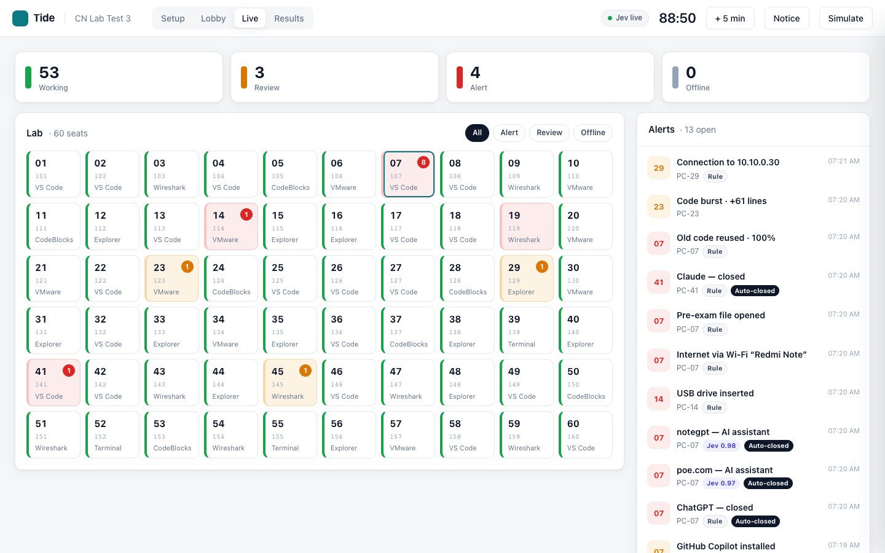
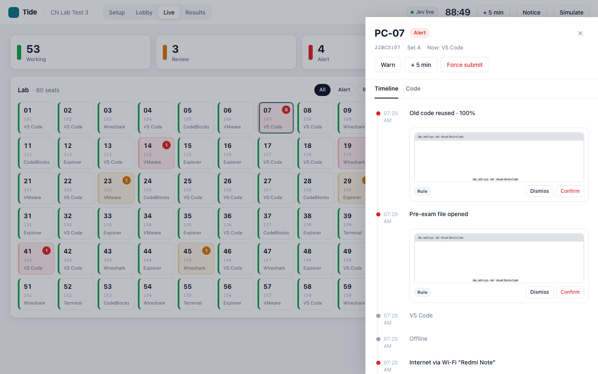
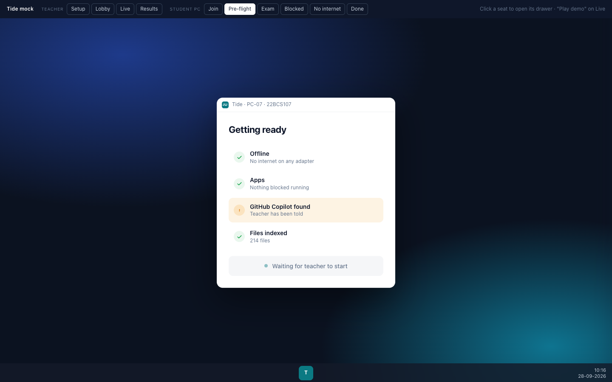
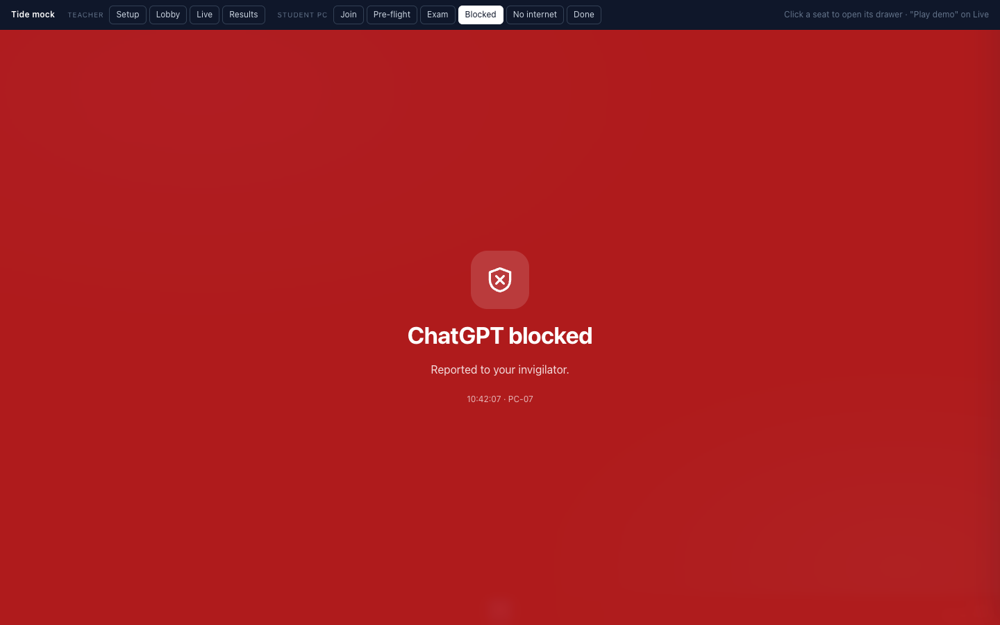

<p align="center"></p>

<p align="center"><b>Lab tests stay honest while students use real developer tools.</b><br>
One small agent per PC, one screen for the invigilator, and an AI classifier that catches the AI.</p>

---

## The problem

A lab test means 60 students and one invigilator. Students need VS Code, CodeBlocks, a terminal, Wireshark and VMware.
The only control today is "unplug the LAN cable", and students beat it: they plug it back in, join a
phone hotspot, open ChatGPT, grab the questions from Classroom before unplugging, or open old code saved on the PC.

## What Tide does

| Cheat | Tide |
|---|---|
| ChatGPT / Claude / Gemini / Copilot in a browser | Reads the address bar and **closes the tab** instantly |
| An AI site or app no block list knows | **Jev** (TypeSafe's decision model) classifies it; at ≥ 0.90 confidence Tide closes it |
| Local AI that needs no internet (LM Studio, Ollama…) | App monitoring **kills it**; unknown AI apps go to Jev |
| Mailing code to yourself, Drive, Classroom, WhatsApp Web | On the block list, **closed instantly** |
| Getting the questions early | Questions exist only in Tide and are released at **Start**, with **odd/even sets** by seat |
| Old code on the PC or a pen drive | Pre-exam file fingerprints, so **"old code reused · 82 %"**, plus USB detection |
| Copying from a neighbour | Different sets, LAN-peer detection, similarity across submissions |
| Killing the agent | The seat goes grey in 10 s (in production it's a Windows service students can't stop) |

**Internet is allowed by default, and monitored.** Keeping 60 PCs offline is what fails today, so Tide
makes it safe to stay online instead. Strict labs can flip one switch to **Internet: Blocked**: then
questions go only to offline PCs, and re-plugging the LAN or joining a hotspot turns the screen red.

Tide **never grades or punishes**. Every flag carries a screenshot, the time, and where it came from
(rule or Jev + confidence), and the teacher dismisses or confirms it.

<p align="center"></p>

<table><tr>
<td></td>
<td></td>
<td></td>
</tr></table>

## How it works (30 seconds)

```
Student PC: Tide Agent ──WebSocket──► Teacher laptop: Tide Server ──► Jev (OpenRouter)
  watch windows, URLs, apps,            pair seats · keep the clock        classify the unknown
  network, files, USB, clipboard        release questions · decide
  act instantly on known cheats         store evidence ──► Console (React)
```

Known cheats are caught by **rules on the student PC** (instant, works offline). Anything unfamiliar
goes to the server and is classified by **Jev**. The **teacher** makes every final call.
Full details: [docs/ARCHITECTURE.md](docs/ARCHITECTURE.md).

## Docs

| Read this | When |
|---|---|
| [docs/ARCHITECTURE.md](docs/ARCHITECTURE.md) | To understand and explain every part, including the honest limitations |
| [docs/DEMO.md](docs/DEMO.md) | The 4-minute demo script, and answers to judges' cross-questions |
| [docs/SETUP_TWO_PCS.md](docs/SETUP_TWO_PCS.md) | Setting up the demo on two new Windows PCs |
| [docs/DEVELOPMENT.md](docs/DEVELOPMENT.md) | Building and testing everything on one machine (fake-PC mode) |
| [docs/specs/](docs/specs/2026-09-28-tide-design.md) | Scope, decisions, acceptance criteria |
| [docs/plans/](docs/plans/2026-09-28-tide-demo-build.md) | Step-by-step implementation plan (25 tasks, test-first) |
| [design/mock-ui.html](design/mock-ui.html) | Clickable UI reference for every screen (open in a browser) |

## Quick start (one machine)

```bash
python3.12 -m venv .venv && source .venv/bin/activate
pip install -e common -e "server[dev]" -e "agent[dev]"
(cd console && npm install && npm run build)
cp .env.example .env.local        # add OPENROUTER_API_KEY (optional; without it Tide uses heuristics)
tide-server --demo                # console at http://localhost:8765, PIN 2468
tide-agent --fake --server 127.0.0.1   # a simulated student PC; type `ai`, `poe`, `wifi`, `old`…
```

## Stack

Python 3.12 · FastAPI · SQLite · WebSockets · pywin32 / UI Automation / psutil · pywebview (WebView2) ·
React + Vite + TypeScript · Jev via OpenRouter Decisions API.

## Status

Built and verified in this repo, following `docs/plans/2026-09-28-tide-demo-build.md` end to end:
78 common+server tests, 30 agent tests (1 Windows-only test skipped off Windows), and 6 console
tests all pass, the console type-checks and builds, and a single-device rehearsal (fake student PC
against the real server with live Jev, internet allowed) caught every scripted cheat correctly. Remaining before a
real two-laptop demo: Task 19's manual verification on real Windows hardware, and the full
`docs/SETUP_TWO_PCS.md` rehearsal.

## License

MIT
